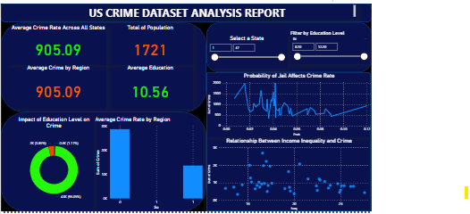

US Crime Dataset Analysis Dashboard

This project analyzes crime rates across US states using Power BI. 
The dashboard explores relationships between education level, income inequality, probability of jail, and crime rates. 
The dataset was sourced from Kaggle and visualized using interactive charts and graphs to extract meaningful insights.

📁 Files Included
- `US_Crime_Analysis_Dashboard_PowerBI.pbix`: Power BI dashboard file
- `uscrime.csv`: Dataset file
- `US_Crime_Dataset_Analysis_Report_ScreenShot.png`: Dashboard screenshot

📚 Dataset Source
- Dataset taken from [Kaggle]

📊 Dashboard Features
- Crime Rate Average Across All States
- Impact of Education Level on Crime Rate
- Probability of Jail Affecting Crime Rate
- Relationship Between Income Inequality and Crime

💡 Skills Demonstrated
- Data Visualization with Power BI
- Dashboard Design and Storytelling
- Data Cleaning and Transformation
- Public Documentation on GitHub

🚀 How to Use
1. Download the repository files.
2. Open `US_Crime_Analysis_Dashboard_PowerBI.pbix` in Power BI Desktop.
3. Explore and interact with the dashboard insights.

